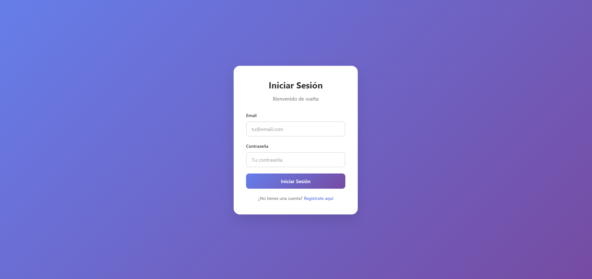
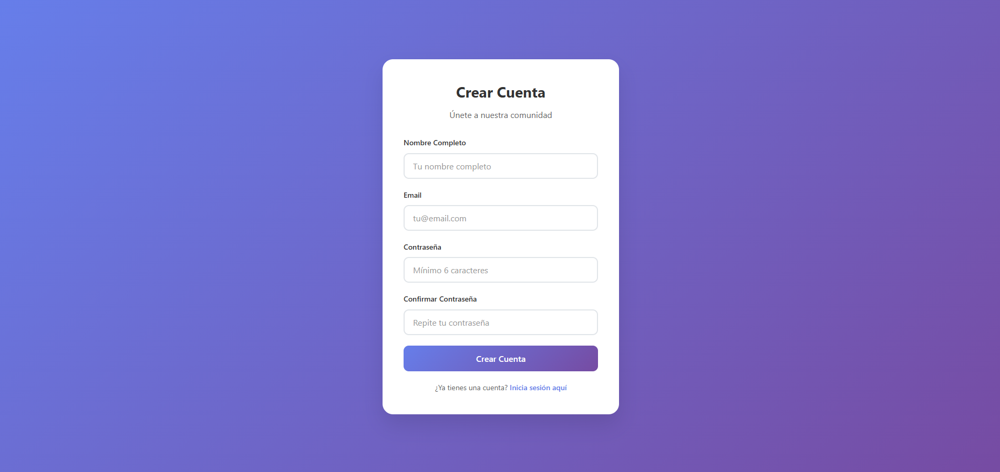
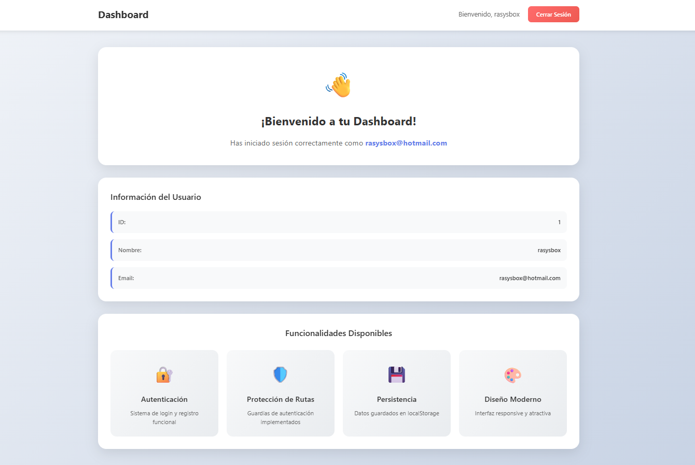

# Sistema de Autenticación Angular

Un sistema completo de login y registro desarrollado en Angular con diseño moderno y funcionalidades avanzadas.

## 🚀 Características

- **Login y Registro**: Formularios completos con validación
- **Protección de Rutas**: Guardias de autenticación implementados
- **Persistencia de Datos**: Almacenamiento en localStorage
- **Diseño Responsive**: Interfaz moderna y adaptable
- **Dashboard**: Panel de usuario con información detallada
- **Animaciones**: Transiciones suaves y atractivas

## 📋 Requisitos Previos

- Node.js (versión 18 o superior)
- npm o yarn

## 🛠️ Instalación

1. **Clonar el repositorio**:
```bash
git clone <url-del-repositorio>
cd auth-app
```

2. **Instalar dependencias**:
```bash
npm install
```

3. **Ejecutar el proyecto**:
```bash
ng serve
```

4. **Abrir en el navegador**:
```
http://localhost:4200
```

## 📁 Estructura del Proyecto

```
src/
├── app/
│   ├── components/
│   │   ├── login/          # Componente de login
│   │   ├── register/       # Componente de registro
│   │   └── dashboard/      # Panel de usuario
│   ├── services/
│   │   └── auth.ts         # Servicio de autenticación
│   ├── guards/
│   │   └── auth-guard.ts   # Guardia de autenticación
│   ├── app.routes.ts       # Configuración de rutas
│   └── app.config.ts       # Configuración de la aplicación
└── styles.scss             # Estilos globales
```

## 🔧 Funcionalidades

### Login
- Formulario de inicio de sesión
- Validación de campos requeridos
- Manejo de errores
- Redirección automática al dashboard

### Registro
- Formulario de creación de cuenta
- Validación de contraseñas
- Verificación de campos
- Redirección automática al dashboard

### Dashboard
- Información del usuario
- Funcionalidades disponibles
- Botón de cerrar sesión
- Diseño responsive

### Autenticación
- Guardias de ruta
- Persistencia de sesión
- Manejo de tokens
- Logout automático

## 🎨 Diseño

El sistema utiliza un diseño moderno con:
- Gradientes atractivos
- Sombras y efectos visuales
- Animaciones suaves
- Paleta de colores coherente
- Tipografía legible

## 🔒 Seguridad

- Validación de formularios
- Protección de rutas
- Manejo seguro de tokens
- Limpieza de datos al logout

## 📱 Responsive

El diseño es completamente responsive y funciona en:
- Dispositivos móviles
- Tablets
- Escritorio

## 📸 Capturas de Pantalla







## 🚀 Despliegue

Para desplegar en producción:

```bash
  ng build --configuration production
```

## 🤝 Contribuir

1. Fork el proyecto
2. Crea una rama para tu feature
3. Commit tus cambios
4. Push a la rama
5. Abre un Pull Request

## 📄 Licencia

Este proyecto está bajo la Licencia MIT.

## 🆘 Soporte

Si tienes alguna pregunta o problema, por favor abre un issue en el repositorio.

---

**¡Disfruta usando el sistema de autenticación!** 🎉 
